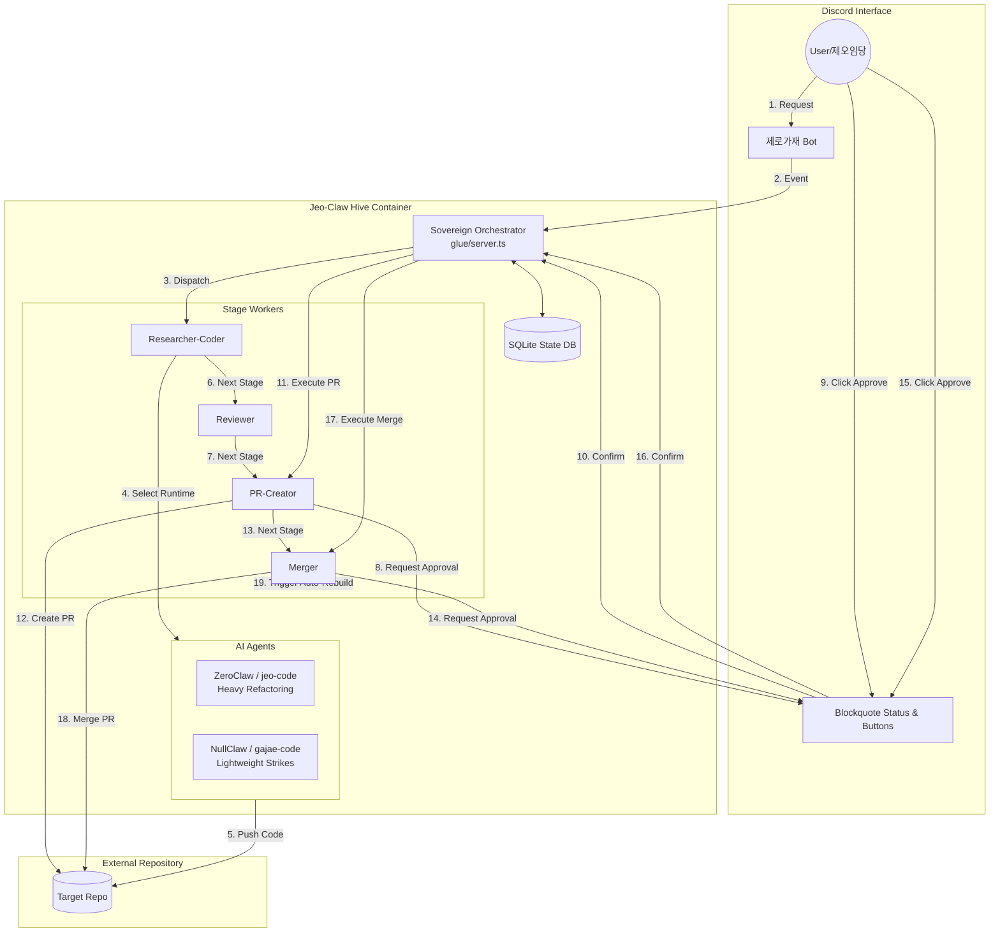

# jeo-claw

<p>
  
  
  
  
  
</p>
<p>
  
  
  
  
  
  
</p>

이중 런타임(**ZeroClaw** · **NullClaw**) 에이전틱 PR 오케스트레이션. 로컬 Docker 우선, **Discord**로 제어, 대상 저장소는 `akillness/jeo-claw` 자체. 두 런타임을 동일 LLM(OpenAI gpt-5) 설정으로 공존시켜 **상시 A/B 비교**하며, 모든 작업은 `ops/` 자기진화 운영체계(계획→검증→지식적재→진화)를 거쳐 claw 스스로를 발전시킨다.

> 설계 근거: `.gjc/specs/deep-interview-jeo-claw-docker-security.md` + `.gjc/plans/ralplan/2026-06-08-0954-05fb/pending-approval.md`. 운영 doctrine: `ops/CONSTITUTION.md` · `ops/WORKFLOW.md` · `ops/RULES.md`.

## 아키텍처 한눈에



역할 파이프라인(각 런타임별 5개 Docker role service): 리서치+코드작성 → 코드리뷰 → PR 리뷰 검수 스케줄링까지는 role service가 담당하고, PR 생성/merge 같은 실제 GitHub write는 `glue-webhook` control plane이 승인 후 brokered token으로 수행한다.

## 보안 자세 (2026 claw 보안 기준)

- 어떤 서비스에도 **호스트 Docker 소켓을 마운트하지 않는다.**
- claw 런타임은 `internal: true` 네트워크에만 연결 → 인터넷 직접 경로 없음. 모든 egress는 **allowlist 프록시**(GitHub/OpenAI/gcloud Secret/Discord)만 통과.
- 모든 장기 서비스 `restart: unless-stopped` (자동 재시작).
- `cap_drop: ALL` + `no-new-privileges` + 읽기전용 루트FS(+tmpfs).
- autonomy=**supervised**, 머지·push 등 고위험은 **Discord 승인 필수**(glue에서 강제).
- PR 생성(`pr.create`)과 머지(`pr.merge`)는 workflow 단위가 아니라 **action-scoped single-use approval**로 승인된다.
- 비밀은 **gcloud Secret Manager**에서 역할별 최소권한으로 주입. 평문 토큰은 이미지/리포에 두지 않는다.
- Discord/webhook control plane은 `discord-bot` + `glue-webhook`으로 분리되며 `claw_internal`에만 붙고, `egress-proxy`만 `edge` 네트워크를 가진다.
- `glue-webhook`은 승인된 `pr.create` / `pr.merge`에 대해 내부 broker helper로 write credential을 로드한 뒤 GitHub write executor를 직접 호출하는 것이 실제 production path다.
- Discord 승인 명령은 승인 채널 + approver 권한(역할 또는 관리자 권한) + 내부 control-event secret을 모두 통과해야 한다.

## 디렉터리 레이아웃

| 경로 | 내용 | 스토리 |
|------|------|--------|
| `docker-compose.yml` | 10개 runtime-role service + split control plane + egress-proxy + 네트워크 | G001/G002 |
| `runtimes/{zeroclaw,nullclaw}/Dockerfile` | 업스트림 빌드 이미지 | G001 |
| `control/Dockerfile` | `glue-webhook` / `discord-bot` control service 이미지 | G002 |
| `compose/egress-proxy/` | squid 설정 + allowlist | G001 |
| `config/` | 런타임 config(toml/json) | G002 |
| `secrets/` | gcloud Secret 로더 | G003 |
| `glue/` | 웹훅 수신 + 단계 상태머신 + 머지 게이트 | G004 |
| `discord/` | Discord 제어 봇 | G005 |
| `compare/` | A/B 러너 + 대시보드 | G006 |
| `scripts/` | 정적 검증 스크립트 | G001 |
| `ops/` | 자기진화 운영체계(doctrine + 지식 vault) — 아래 참조 | — |

## 부트스트랩

```bash
# 1) 의존성
bun install

# 2) 환경 변수 (실제 비밀은 절대 커밋 금지 — gcloud Secret Manager에서 주입)
cp .env.example .env   # 비-비밀 ID/설정만 채움

# 3) 정적 보안 검증 (docker 불필요)
bun run check:compose
bun test

# 4) 기동 (Docker 환경에서)
docker compose up -d --build
docker compose ps          # egress-proxy/glue-webhook/discord-bot + 10개 runtime-role service healthy 확인
```

## 사용 가이드

### 1. 검증 / 정적 게이트 (Docker 불필요)

오케스트레이션 글루는 Bun+TypeScript이며, 실제 컨테이너 없이도 아래 게이트로 동작을 검증한다.

```bash
bunx tsc --noEmit                              # 타입 체크 (strict; noEmit)
bun test                                       # 전체 단위/통합/레드팀 테스트
bun run check:compose                          # docker-compose 정적 보안 검사
bun run config/validate.ts                     # A/B 공정성 + 런타임 config 검사
bun run smoke:glue                             # 로컬 HTTP+승인+brokered write 스모크
bun run preflight:live                          # 라이브 Secret Manager/Discord 입력 사전검증
docker compose --env-file .env.example config --quiet  # compose 환경 구성 검증
```

마지막 검증 기준(green): `tsc` 0 errors · `bun test` pass / 0 fail · `check:compose` 176/176 · `config/validate.ts` 24/24 · `smoke:glue` pass · `docker compose --env-file .env.example config --quiet` success.

**런타임 스모크 (실 서버 기동 검증, Docker/gcloud 불필요)**: `bun run smoke:glue`는 `glue/server.ts`를 로컬 HTTP 서버로 띄우고, 주입식 fake Secret/GitHub/runtime wrapper로 아래 전체 라이프사이클을 검증한다.

| 검증 | 기대 |
|------|------|
| `GET /health` | `200 {ok:true}` |
| `POST /control-event` (시크릿 없음/오류) | `401` |
| `POST /webhook/github` (위조 HMAC) | `401` |
| `POST /webhook/github` (유효 HMAC·미매칭 wf) | `202` no-op |
| `POST /dispatch` (시크릿 없음/금지 필드 `token`) | `401` / `400` |
| `request zeroclaw ...` | `research-code`·`review` wrapper dispatch 후 `pr.create` 승인 대기 |
| `approve <wf> pr.create` | brokered RW token은 glue 내부에서만 사용해 GitHub PR 생성, `pr-review-schedule` dispatch 후 `pr.merge` 승인 대기 |
| `approve <wf> pr.merge` (CI/review 전) | merge 호출 없음, `awaiting-approval` 유지 |
| CI/review webhook | boolean `true` 기록 후 이미 승인된 merge만 brokered RW token으로 실행, 최종 `merged` |

### 2. 로컬에서 글루 서버 띄우기

```bash
GCLOUD_PROJECT=dev-project GCLOUD_SECRET_PREFIX=jeo-claw TARGET_REPO=akillness/jeo-claw TARGET_BRANCH=main GITHUB_WEBHOOK_SECRET=dev-secret JEO_CONTROL_EVENT_SECRET=dev-control-secret JEO_RUNTIME_DISPATCH_SECRET=runtime-dispatch-secret bun run glue   # glue/server.ts, 기본 :8787
```

HTTP 서피스(`glue/server.ts`):

| 메서드 · 경로 | 용도 | 응답 |
|------|------|------|
| `GET /health` | 헬스체크 | `200 {ok:true}` |
| `POST /control-event` | Discord 제어 이벤트 주입(`ControlEvent` JSON) | `x-control-event-secret` 필수, request→`201`, approve/reject→`200`/`404`, config-set→`501` |
| `POST /webhook/github` | GitHub 웹훅 수신 | HMAC 서명(`x-hub-signature-256`) 필수, 위조 시 `401` |
| `POST /dispatch` | 승인된 write 액션 호환 receipt 경로(토큰 비반환) | `x-control-event-secret` 필수, workflow/runtime/stage/action 일치 + 준비 완료 시 `200` + no credential, 아니면 `401/403/404` |

웹훅은 `?workflowId=` 쿼리 → 바디 `workflowId/id` → `prNumber` 순으로 워크플로우를 매칭한다. 매칭 실패 시 `202`(no-op).

빠른 확인 예:

```bash
# 새 워크플로우 시작
curl -s -XPOST localhost:8787/control-event \
  -H 'content-type: application/json' \
  -H 'x-control-event-secret: dev-control-secret' \
  -d '{"type":"request","runtime":"zeroclaw","request":"fix flaky test"}'
# → {"success":true,"workflow":{"id":"wf-...","stage":"pr-create","status":"awaiting-approval",...}}
```

### 3. claw 실제 동작 절차

1. **비밀 등록** — `GCLOUD_SECRET_PREFIX` 기준으로 gcloud Secret Manager에 외부 필수 비밀 `<prefix>-openai-codex-oauth`(Codex `auth.json` 형식의 ChatGPT 구독 OAuth 자격, access+refresh token), `<prefix>-github-token-ro`, `<prefix>-github-token-rw`, `<prefix>-discord-bot-token`를 등록한다. 내부 공유 비밀 `<prefix>-github-webhook-secret`, `<prefix>-control-event-secret`, `<prefix>-runtime-dispatch-secret`도 Secret Manager에 있어야 하며 CSPRNG로 생성한다. 평문 토큰은 `.env`·이미지·로그에 두지 않는다. 정적 OpenAI API key는 더 이상 사용하지 않는다(OAuth 전환: `ops/specs/oauth-provider-auth/`).
2. **Discord 봇 정보** — 필수 Discord 입력은 Discord bot token과 guild 접근 권한이다. `DISCORD_GUILD_ID`는 봇이 여러 guild에 들어가 있으면 필요하고, 하나의 guild만 연결돼 있으면 자동 선택된다. `DISCORD_REQUEST_CHANNEL_ID` / `DISCORD_APPROVAL_CHANNEL_ID`는 선택값이며 비어 있으면 `DISCORD_REQUEST_CHANNEL_NAME` / `DISCORD_APPROVAL_CHANNEL_NAME`(기본 `jeo-request` / `jeo-approval`)로 채널을 찾거나 생성한다. `DISCORD_APPROVER_ROLE_ID`는 비관리자 승인자를 허용할 때만 필요하다. 봇은 시작 시 guild slash command(`request`/`approve`/`reject`/`config`)를 등록한다.
3. **비-비밀 환경 설정** — `.env.example`을 `.env`로 복사하고 `GCLOUD_PROJECT`, `GCLOUD_SECRET_PREFIX`, `TARGET_REPO`, `TARGET_BRANCH`, 필요한 경우 guild/channel override만 채운다. 상태/대시보드 채널은 현재 선택/dormant 필드다.
- 로컬/CI에서 gcloud ADC 없이 컨테이너 기동만 검증하려면 `JEO_SECRET_SOURCE=file`, `JEO_SECRETS_FILE=/run/secrets/jeo-claw-secrets.json`을 주고, override compose로 비커밋 JSON secret file을 read-only mount한다. production 기본값은 계속 `gcloud`다.
- 컨테이너 내부 mocked end-to-end 검증이 필요하면 `GITHUB_API_BASE_URL=http://github-api-mock:8788`와 `scripts/mock-github.ts`를 사용해 control-plane write path를 실제 GitHub 없이 검증할 수 있다.
4. **사전 검증** — `bun run preflight:live`, `bunx tsc --noEmit`, `bun test`, `bun run check:compose`, `bun run config/validate.ts`, `bun run smoke:glue`, `docker compose --env-file .env.example config --quiet`를 모두 통과시킨다.
5. **기동** — Docker 환경에서 `docker compose up -d --build`를 실행한다. 정상 구성은 `egress-proxy`, `glue-webhook`, `discord-bot`, ZeroClaw 5개 role service, NullClaw 5개 role service다.
6. **요청 시작** — Discord에서 `/request` 또는 `request <zeroclaw|nullclaw> <요청>`을 보낸다. `research-code`, `review`, `pr-review-schedule`은 내부 runtime wrapper가 artifact/receipt를 만들고, glue가 다음 stage로 진행시킨다.
7. **고위험 승인** — `pr.create`와 `pr.merge`는 각각 `/approve <workflowId> pr.create`, `/approve <workflowId> pr.merge`(또는 평문 명령)로 단건 승인한다. 승인은 1회용으로 소비되며 workflow/runtime/stage/action이 맞지 않으면 거부된다.
8. **merge 조건** — `ciPassed === true`, `reviewPassed === true`, Discord `pr.merge` 승인 세 조건이 모두 strict boolean `true`일 때만 merge가 실행된다. truthy 값·누락 값은 차단된다.
9. **문제 대응** — `401`은 secret/header 불일치, `403`은 workflow/action/role mismatch 또는 미승인, `413`은 과대 webhook/runtime dispatch payload, `501 config-set`은 의도된 미구현이다. 상태 저장소는 in-memory bounded retention이라 재기동 시 진행 중 workflow는 보존되지 않는다.

### 4. Discord 제어 명령어

봇은 `discord/commands.ts`의 `parseCommand`로 슬래시(`/cmd`)·평문 양쪽을 파싱한다. 고위험 액션은 **workflow id + action**을 모두 명시해야 승인된다.

| 명령 | 의미 |
|------|------|
| `request <zeroclaw\|nullclaw> <요청>` | 해당 런타임으로 새 워크플로우 시작 |
| `approve <workflowId> <action>` | 고위험 액션 단건 승인 (action-scoped, single-use) |
| `reject <workflowId> <action>` | 고위험 액션 거부 |

- `<action>` 허용값: `pr.create`, `pr.merge`.
- `config set`은 현재 미구현이며, 봇과 glue 모두 명시적으로 거부한다(`not implemented`).

### 5. 워크플로우 라이프사이클

```
research-code → review → pr-create → pr-review-schedule → merge
```

- 각 stage는 5개 역할(`researcher-coder` … `merger`)에 1:1 매핑되고, 실제 stage 실행은 각 런타임 컨테이너의 dispatch wrapper가 work artifact + receipt를 만들고, 승인된 GitHub write만 `glue-webhook`이 직접 수행한다.
- **PR 생성**(`pr.create`)과 **머지**(`pr.merge`)는 진행 전 Discord 승인이 필요하며, 승인은 1회용으로 소비된다.
- **머지 게이트**(`glue/merge-gate.ts`)는 `ciPassed && reviewPassed && discordApproved`가 **모두 boolean `true`**일 때만 main 머지를 허용한다(엄격 비교 — truthy 우회 차단). 하나라도 빠지면 차단 사유를 반환한다.

### 6. A/B 비교 모듈

`compare/runner.ts`, `compare/metrics.ts`, `compare/dashboard.ts`는 현재 라이브 수집기 없이 라이브러리/테스트 helper로 유지된다. `bun run compare`는 명시적으로 실패하며, 실제 운영 커맨드로 노출하기 전에 샘플 수집기를 연결해야 한다.

## 자기진화 운영체계 (`ops/`)

claw의 모든 작업을 **계획 → 검증 → 지식적재 → 진화** 한 사이클로 묶는 운영 doctrine + 지식 자산 폴더. 6개 스킬을 하나의 루프로 통합해, claw가 사용자 요청·작업을 통해 학습하고 스스로를 발전시킨다.

| 스킬 | 이 시스템에서의 역할 | 위치 |
|------|----------------------|------|
| **spec-kit** | 모든 작업의 기본 워크플로우(계획→검증) | `ops/WORKFLOW.md`, `ops/templates/` |
| **rtk** | 전 구간 셸/조사 출력 토큰압축 | `ops/toolchain/rtk.md` |
| **graphify** | 완료 작업·코드·문서의 지식적재(관계 그래프) | `ops/toolchain/graphify.md`, `ops/vault/graphify-out/` |
| **obsidian** | 적재 파일/폴더 관리·wikilink·frontmatter | `ops/toolchain/obsidian.md`, `ops/vault/` |
| **llm-wiki** | graphify 지식을 참조·검색·진화시키는 유지보수 계약 | `ops/toolchain/llm-wiki.md`, `ops/vault/wiki/` |
| **deepinit** | 계층형 `AGENTS.md` 문서 | 각 폴더 `AGENTS.md` |

```
Discord 요청 ─▶ spec-kit 워크플로우(rtk 토큰압축, 전 구간) ─▶ 검증된 결과물
   ─▶ graphify 지식적재 ─▶ obsidian vault 파일/폴더 관리 ─▶ llm-wiki 참조·검색
   ─▶ 다음 요청은 vault 먼저 검색(EVOLVE) ─▶ 반복 패턴은 규칙 승격(claw 자체 발전)
```

### 표준 절차 (`ops/WORKFLOW.md`)

```
0 INTAKE → 1 CONSTITUTION → 2 SPECIFY → 3 CLARIFY? → 4 PLAN → 5 TASKS
        → 6 ANALYZE? → 7 IMPLEMENT(고위험은 Discord 승인) → 8 VERIFY(4대 게이트)
        → 9 CAPTURE(지식적재) → 10 EVOLVE(되먹임)
```

### 폴더 구조

| 경로 | 역할 |
|------|------|
| `ops/CONSTITUTION.md` | 불가침 원칙(보안·spec우선·검증·A/B공정성·진화·토큰·사람통제) |
| `ops/RULES.md` | 6개 스킬을 묶는 통합 운영 규칙 마스터(진입점) |
| `ops/WORKFLOW.md` | 요청→specify→plan→tasks→implement→verify→적재→진화 표준 절차 |
| `ops/toolchain/` | rtk·graphify·obsidian·llm-wiki 통합·사용 가이드 |
| `ops/templates/` | spec/plan/tasks/checklist/request 양식(spec-kit 파이프라인) |
| `ops/vault/` | obsidian+llm-wiki 지식 베이스 — `raw/`(불변) · `wiki/`(LLM 소유) · `index.md` · `log.md` |
| `ops/scripts/capture-knowledge.ts` | 9-CAPTURE 실행 스크립트(+단위 테스트) |

> 우선순위: `CONSTITUTION.md` > `RULES.md` > `WORKFLOW.md` > `toolchain/*`. 새 작업은 `ops/RULES.md`부터 읽고 `ops/vault/index.md` 검색으로 시작한다.

### 지식적재 (CAPTURE)

완료 직후 실행 — raw 원천(불변) + wiki 요약 stub + `log.md` append + `index.md` 링크를 자동 갱신한다.

```bash
bun run ops/scripts/capture-knowledge.ts \
  --title "<작업 제목>" \
  --slug "<slug>" \
  --summary "<무엇을·왜·결과>" \
  --tags "domain,security,glue" \
  --runtime both \
  --evidence "artifacts/verify-transcript.txt"
```

규칙: `raw/`는 불변(재작성 금지), `wiki/`는 LLM 소유(정정은 여기서). 적재는 write-if-absent로 기존 자산을 보존하며, `index.md`/`log.md`는 idempotent하게 갱신된다.

## 라이브 실행에 필요한 사용자 자격증명

다음은 사용자가 `GCLOUD_SECRET_PREFIX` 기준으로 gcloud Secret Manager에 등록해야 하며(역할별 최소권한), 코드/이미지에 평문으로 두지 않는다:
`<prefix>-openai-codex-oauth`(ChatGPT OAuth, Codex `auth.json` 형식), `<prefix>-github-token-ro`, `<prefix>-github-token-rw`(control-plane approved writes용), `<prefix>-github-webhook-secret`, `<prefix>-discord-bot-token`, `<prefix>-control-event-secret`, `<prefix>-runtime-dispatch-secret`.

## 상태

최신 ultragoal 실행은 complete 상태이며, 진행/검수 이력은 `.gjc/ultragoal/ledger.jsonl`에 남는다. 작업별 지식 적재 이력은 `ops/vault/log.md`.

### 최근 시스템 업데이트 (2026-06)
- **GJC (Gajae Code) 완벽 연동**: `jeo-claw-hive` 단일 컨테이너 내부에서 NPM 프록시 차단(`registry.npmjs.org`) 및 `ReadOnlyFileSystem`(`tmpfs` 마운트) 이슈를 완벽히 해결하여, 디스코드 핑만으로 깃 클론부터 에이전트 수정까지 자동화되는 라이브 파이프라인이 정상 가동 중입니다.
- **Workflow 엔진 안정화**: 디스코드 파서의 링크 인식 오류 및 SQLite Workflow 큐 엔진 버그 픽스가 완료되었습니다.

GJC Test

Pipeline E2E Live Verification - 2026-06-20 (Merge Fix Test)
